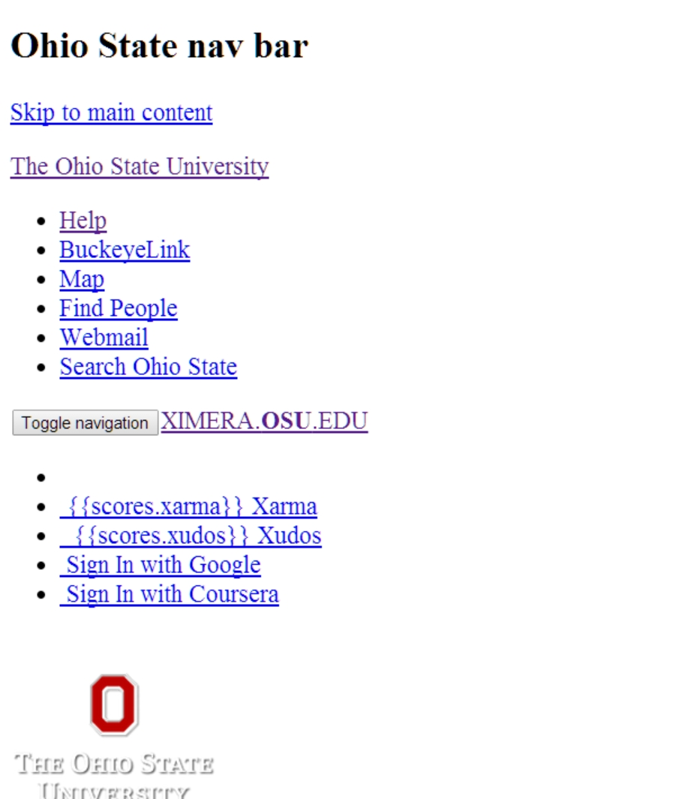

The XIMERA Project
==================
LaTeX to online interactive materials. 

Setting up a server
===================
If you want to install it on Windows, set 'Setting up a server on Windows' below.

1. Install `g++`, `nodejs` and `mongodb` on your computer (under Debian, may also need `nodejs-legacy` package)
2. Run an instance of mongo server:

        mongod --dbpath <insert-your-path>
You may have to make the path. For example,

        mkdir -p /tmp/data/db
        mongod --dbpath /tmp/data/db
3. Fetch and unpack the [sample database](https://drive.google.com/file/d/0B-Xh-RAGRDU8WHAxeUJfVGpTSk0/edit?usp=sharing)
Unpack the tarball:

        tar xfzv database.tar.gz
This creates a directory containing BSON and JSON files

4. Import the database into mongo:

        mongorestore <path-to-db-directory-with-BSON-files>

5. Clone the repository:

        git clone https://github.com/kisonecat/ximera

6. Create file `env.sh` with content:

        export XIMERA_MONGO_URL=127.0.0.1
        export XIMERA_MONGO_DATABASE=test
        export XIMERA_COOKIE_SECRET=thisismysecretcookieyoushouldchangethis
        export COURSERA_CONSUMER_KEY=thisisacourserakey
        export COURSERA_CONSUMER_SECRET=courserasecretkey
        export LTI_KEY=myltikey
        export LTI_SECRET=myltisecret
        export GITHUB_WEBHOOK_SECRET=githubwebhooksecret

Type `source env.sh` to execute those commands

Note that if you used a different database name, you should set XIMERA_MONGO_DATABASE to the name of your database.

7. Go into the `ximera` directory within the `kisonecat` repository and use `npm` to install all other js scripts needed by the server

        cd <path-to-ximera>
        npm install (you may be required to answer a prompt or two)
You might have to install bower by running the following commands

        node ./node_modules/bower/bin/bower install
        cd ./components/mathquill
        npm install
        cd ../..
        mkdir -p components/syntaxhighlighter/amd
        node node_modules/requirejs/bin/r.js -convert components/syntaxhighlighter/scripts components/syntaxhighlighter/amd
8. Run the `ximera` server `apps.js` using:

        node app.js

9. View the `ximera` server in your web browser at `localhost:3000`

Setting up a server on Windows
==============================
Before we get started, I must inform that I implemented a portable version of the server.  You may need to make minor variations to the environment variables if you install it formally (meaning into the Windows registry).

1. Download the necessary programs.
	1. Download [nodejs](http://nodejs.org/download/).  I downloaded the Windows binary (.exe) version into my working directory.  Choose 32-bit or 64-bit based on your system.
	2. Download [mongodb](http://www.mongodb.org/downloads).  I downloaded the `zip` version portable version and decompressed it into a subfolder of my working directory, rather than the `msi` installer.
	3. Download the most recent version of [npm](http://nodejs.org/dist/npm/) and decompress it.
	4. Download [the sample database](https://drive.google.com/file/d/0B-Xh-RAGRDU8WHAxeUJfVGpTSk0/edit?usp=sharing).  It will be a `.tar.gz` file.  You will need to decompress it.  I good utility to use is [7zip](http://www.7-zip.org/download.html).  This will create a folder called `test` which should contain a bunch of `.BSON` and `.JSON` files.

2. Clone the ximera server repository by running `git clone https://github.com/kisonecat/ximera` in the command prompt in your working directory.  An easy way to get to the command prompt from the windows file explorer is to *hold down Shift* and right click on the folder and select 'Open command window here'.
3. Make a batchfile with the following lines.

		:: change to wherever node.exe resides.  Use %~dp0 for the path of the location of this batch file.
		SET NodejsPath=%~dp0
		:: change to whereever npm.cmd resides.
		SET NPMPath=%~dp0
		:: This is the folder where the mongod.exe file lives, within the mongdb directory.  %~dp0 heads it off because it is a subfolder of %~dp0.
		SET MongoDBPath=%~dp0mongodb-win32-x86_64-2008plus-2.6.3\bin
		:: Implement these into the system path, for this session.
		SET Path=%path%%NodejsPath%;%NPMPath%;%MongoDBPath%
		SET XIMERA_MONGO_URL=127.0.0.1
		SET XIMERA_MONGO_DATABASE=test
		SET XIMERA_COOKIE_SECRET=thisismysecretcookieyoushouldchangethis
		SET COURSERA_CONSUMER_KEY=thisisacourserakey
		SET COURSERA_CONSUMER_SECRET=courserasecretkey
		SET LTI_KEY=myltikey
		SET LTI_SECRET=myltisecret
		SET GITHUB_WEBHOOK_SECRET=githubwebhooksecret
4. Open the command window and run the following commands
	1. Run the batch file you created typing in the name of the batch file.
	2. Change to the ximera server folder: `cd ximera`
	3. Run `npm install` to install all the other js scripts needed by the server.  This will take a while.  I get the error line: `npm ERR! not ok code 0`. Just ignore it.
	4. Run an instance of mongo as by running: `mongod --dbpath .` (dont forget the period)
5. Without closing that command window, open another one 
	1. Run the batch file again.
	2. Import the test database into mongo by running: `mongorestore ./test/`, changing the path appropriately.  The Windows UAC will pop up.  You will need administrator access to bypass it.
	3. Change to the ximera server folder: `cd ximera`
	4. Run `app.js`: `node app.js`.  You will have another UAC pop up asking whether to give node public network access.
6. Open the browser and type in `localhost:3000` into the command line and you should get this:

The css files are missing (if you noticed, after you opened your browser, in the command window you got the error `LESS file error : 'bootstrap.less' wasn't found` )

